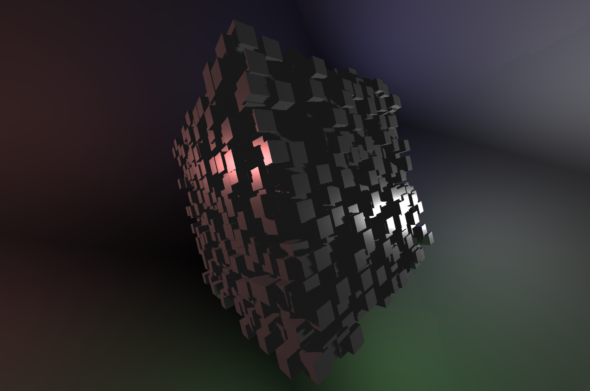

# three-instanced-mesh

A reference project enabling geometry instancing for threejs' materials.

```typescript
import * as THREE from 'three'
import { InstancedMesh } from './instanced/mesh'

...
const geometry = new THREE.BoxBufferGeometry(1, 1, 1)
const material = new THREE.MeshStandardMaterial({
  color: 0x888888,
  metalness: 0.1,
  roughness: 0.4,
})
// create 4096 instances of this mesh
const mesh = new InstancedMesh(4096, geometry, material)
for(const instance of mesh.instances) {
  instance.position.x = (Math.random() * 16) - 8
  instance.position.y = (Math.random() * 16) - 8
  instance.position.z = (Math.random() * 16) - 8
}
mesh.updateInstances()

```

### overview

This project is a small reference project for enabling geometry instancing in threejs' and having it itegrate with threes existing material and shadow mapping pipeline. This project provides reference `depth`, `distance` and `standard` material shaders and a small demo.

A demo of this project can be found [here](https://codepen.io/anon/pen/wROjJV)




### running locally

Ensure nodejs is installed. Clone this project and run.
```
npm start
```
This will start a watch server on `http://localhost:5000`
